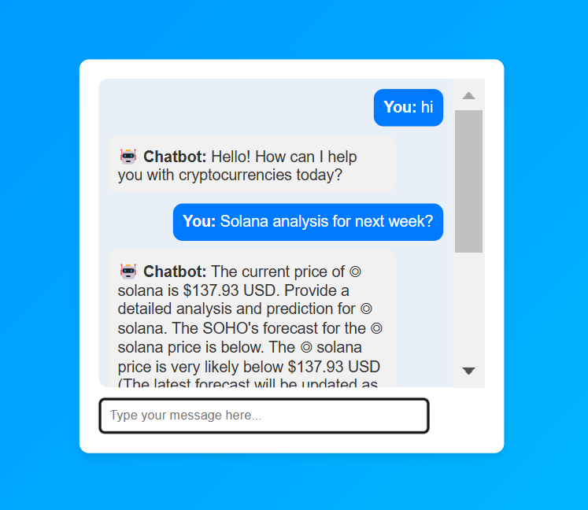

# Chatbot Introduction



## Overview

Welcome to our chatbot project! This document provides an introduction to our chatbot, including the model we use and our future plans for improving it.

## Current Model

Our chatbot is currently powered by the GPT-3 model developed by OpenAI. GPT-3 is a state-of-the-art language model that can generate human-like text based on the input it receives. It is capable of understanding and responding to a wide range of queries, making it an ideal choice for our chatbot.

## Future Plans

In the next deployment, we plan to collect data from the current chatbot interactions. This data will be used to train a more refined model that better understands and responds to user queries. By continuously improving the model with real-world data, we aim to enhance the chatbot's performance and user experience.

## Running the Model Locally

To run the model locally, follow these steps:

1. Clone the repository:
    ```bash
    git clone https://github.com/your-repo/chatbot.git
    cd chatbot
    ```

2. Install the required dependencies:
    ```bash
    pip install -r requirements.txt
    ```

3. Set up your OpenAI API key:
    ```bash
    export OPENAI_API_KEY='your-api-key'
    ```

4. Run the chatbot script:
    ```bash
    python chatbot.py
    ```

Stay tuned for more updates as we continue to develop and improve our chatbot!

